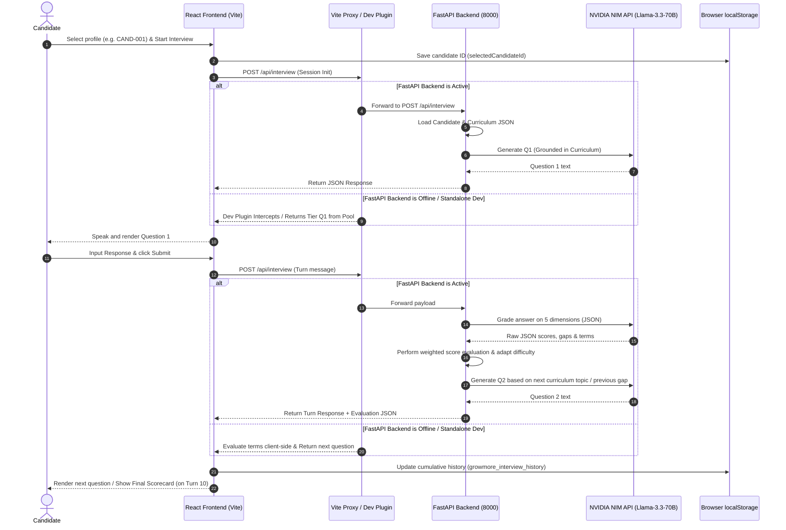

# GrowMore Interview

Welcome to **GrowMore Interview**, the official AI-powered technical interview agent and candidate telemetry platform designed for cohort members of the 31-Day AI Engineering curriculum. 

If you are a new developer joining the team, this guide will serve as a personal walkthrough of the architecture, codebase, APIs, and data structures. We designed this project to bridge the gap between structured daily curriculum learning and realistic technical evaluation.

---

## 📖 What the Project Does & Why It Exists

During the 31-Day AI Engineering Cohort, candidates work through 8 intensive technical modules. To measure mastery, they undergo a **20-minute, 10-question adaptive technical interview sandbox**. 

### The Core Problem GrowMore Solves:
1. **Interactive Evaluation**: Instead of rigid multiple-choice tests, candidates are interviewed by an active AI agent that adapts the difficulty of questions on-the-fly based on the technical depth of their answers.
2. **Grounded Curriculum Recommendations**: If a candidate struggles with a specific topic (e.g., Reciprocal Rank Fusion or HNSW graph parameters), the platform matches their gaps directly to the corresponding day in the 31-day roadmap.
3. **Long-term Telemetry**: Candidate profiles track first-try pass rates, active streaks, and multi-session performance, persisting this intelligence directly in the browser.
4. **Proctored Integrity**: A strict window-focus and screenshot proctoring subsystem locks down the browser during evaluations to ensure authentic responses.

---

## 🌟 Key Features

* **Candidate Dashboard & Switches**: Swap profiles among **20 preloaded real cohort candidates** (`candidates.json`). The dashboard immediately displays their completed missions, streak activity, and growth stats.
* **31-Day Interactive Curriculum Roadmap**: A visual representation of the learning journey divided into 8 modules:
  1. *Environment & Tooling* (Days 1–3)
  2. *Data Foundations* (Days 4–6)
  3. *Embeddings & Vector Search* (Days 7–10)
  4. *LLM Core & Prompting* (Days 11–15)
  5. *Chatbot Application Build* (Days 16–20)
  6. *Agentic AI & Model Context Protocol (MCP)* (Days 21–24)
  7. *Security & Deployment* (Days 25–28)
  8. *Production & Capstone* (Days 29–31)
* **Adaptive AI Evaluation Sandbox**: A proctored interview dashboard featuring:
  * Timed 20-minute countdown evaluations.
  * Turn-by-turn difficulty adjustments (`Easy` ⇄ `Medium` ⇄ `Hard`).
  * Web Speech API voice synthesis for auditory question delivery.
  * Realistic anti-cheat proctoring: 3-strike tab focus tracking, screen blurring overlays, and keyboard shortcut overrides.
* **Mastery scorecarding**: A detailed breakdown evaluating candidates across 5 core dimensions:
  * *Technical Depth*, *System Reasoning*, *Curriculum Mastery*, *Communication*, and *Production Readiness*.
  * Actionable Study Checklist showing direct "Study Day X" navigation links based on identified gaps.
* **Module 6 Agentic Sandbox**: Visualizer for Model Context Protocol (MCP) server capabilities, mock tool execution, and multi-agent reasoning loops.

---

## 🏗️ System Architecture

GrowMore features a decoupled architecture designed to be resilient in offline environments. In development, the Vite Dev Server intercepts API calls and processes them using mock engines if the Python FastAPI backend is not running.

### Data and Control Flow



---

## 🛠️ Technologies Used

### Frontend Stack
* **React 19.2.8** (Single Page App structure)
* **Vite 8.2.0** (Build tool & development dev server)
* **Tailwind CSS v4.3.3** (Styling utility framework via `@tailwindcss/vite`)
* **Framer Motion 13.0.0** (Animations, modals, transitions)
* **Lucide React 1.30.0** (Vector icons)

### Backend Stack
* **FastAPI 0.110.0** (ASGI Web API)
* **Uvicorn 0.28.0** (ASGI Server implementation)
* **Pydantic v2 & Pydantic Settings** (Configuration & Request validation schemas)
* **OpenAI Python SDK 1.14.0** (Used to interface with NVIDIA NIM API using OpenAI compatibility)
* **Pytest 8.1.0** (Python unit testing)
* **Oxlint 1.75.0** (Super-fast Javascript linter)

---

## 📁 Repository Structure

Below are the key folders and files that govern the application's runtime logic:

```
GrowMore/
├── backend/                   # FastAPI Python backend application
│   ├── core/                  
│   │   └── config.py          # Settings validation (Pydantic Settings config)
│   ├── data/                  
│   │   ├── candidates.json    # 20 real cohort candidate profiles (Metadata & signals)
│   │   └── curriculum.json    # 31-day curriculum modules, tools, and objectives
│   ├── models/                
│   │   └── schemas.py         # Request / Response Pydantic models
│   ├── services/              
│   │   ├── llm/               
│   │   │   ├── base.py        # Base provider interface
│   │   │   ├── factory.py     # Provider factory resolver
│   │   │   └── nvidia_provider.py # NVIDIA NIM API connector (OpenAI SDK wrapper)
│   │   ├── candidate_loader.py# Reads candidate profiles from JSON
│   │   ├── curriculum_retriever.py # Handles curriculum tracking & gap recommendations
│   │   ├── evaluator.py       # Grader, computes scores, adapts difficulty levels
│   │   ├── feedback_generator.py # Formulates final candidate scorecard report
│   │   ├── interview_engine.py# Central engine, tracks state, cap limits, timer, etc.
│   │   ├── question_generator.py # Formulates next questions grounded in curriculum
│   │   └── state_manager.py   # Manages in-memory sessions & proctoring flags
│   ├── state/                 
│   │   └── interview_state.py # Pydantic schema representing session state
│   ├── tests/                 # Python pytest files checking every phase of the engine
│   ├── main.py                # FastAPI entry point
│   ├── requirements.txt       # Backend dependencies
│   └── .env.example           # Backend environment template
├── src/                       # React frontend source files
│   ├── components/            # Shared UI components
│   │   ├── InterviewerAvatar.jsx # Renders interactive animations based on speaking state
│   │   ├── Navbar.jsx & Footer.jsx
│   │   └── ProfileCard.jsx    # Candidate telemetry display
│   ├── data/                  
│   │   ├── candidate.js       # LocalStorage helpers for selected candidate
│   │   ├── candidates.json    # Identical dataset for client-side matching
│   │   └── curriculum.json    # Curriculum details for visual roadmap rendering
│   ├── pages/                 
│   │   ├── Dashboard.jsx      # Telemetry graphs & streak monitoring
│   │   ├── Interview.jsx      # Main focus-locked proctored sandbox page
│   │   ├── Profile.jsx        # Editable cohort credentials and certification badges
│   │   ├── Report.jsx         # Candidate performance scorecard & checklist
│   │   ├── Roadmap.jsx        # Day 1-31 visual cohort progression tree
│   │   └── TrackImprove.jsx   # Multi-session graph summaries & study items
│   ├── services/              
│   │   ├── agenticApi.js      # Module 6 MCP server tool bindings & fallback
│   │   ├── historyService.js  # Candidate evaluation history local-storage manager
│   │   └── interviewApi.js    # Client-side endpoint fetcher & offline fallback
│   ├── App.jsx                # Router config & view transitions
│   ├── index.css              # Styling tokens & global styling settings
│   └── main.jsx               # React SPA mounting script
├── package.json               # Frontend dependencies & npm scripts
├── vite.config.js             # Vite configuration with embedded dev API mock plugin
└── PROMPTS.md                 # Developer log mapping prompt telemetry
```

---

## ⚙️ Environment Variables

Copy `backend/.env.example` into a new file `backend/.env`. The backend validates configurations on startup using Pydantic:

| Variable | Required | Default | Purpose |
|---|---|---|---|
| `NVIDIA_API_KEY` | **Yes** | (Placeholder) | NVIDIA NIM developer API key for accessing LLM inference. |
| `NVIDIA_BASE_URL` | No | `https://integrate.api.nvidia.com/v1` | Base URL of the OpenAI-compatible NVIDIA NIM gateway. |
| `NVIDIA_MODEL` | No | `meta/llama-3.3-70b-instruct` | LLM model used for evaluations and question generation. |
| `HOST` | No | `0.0.0.0` | Bind host address for the FastAPI server. |
| `PORT` | No | `8000` | Port on which the FastAPI application runs. |
| `ENVIRONMENT` | No | `development` | Dictates application logging and configuration environments. |

---

## 🚀 Setup & Installation

### Local Setup (Separate Terminals)

#### 1. Python Backend Setup
First, ensure you have Python 3.10 or higher installed.
```bash
# Navigate to backend folder
cd backend

# Create a virtual environment
python -m venv .venv

# Activate the virtual environment
# Windows (PowerShell):
.venv\Scripts\Activate.ps1
# Windows (CMD):
.venv\Scripts\activate.bat
# Linux/macOS:
source .venv/bin/activate

# Install required dependencies
pip install -r requirements.txt

# Configure settings
cp .env.example .env
# Edit .env with your NVIDIA_API_KEY
```

#### 2. Frontend React Setup
Open a separate terminal window at the repository root directory.
```bash
# Install node packages
npm install
```

---

## 🏃 Running the Application

### 1. Launch Backend Server
In the backend terminal, run:
```bash
python main.py
```
* **Backend API URL**: `http://localhost:8000`
* **Swagger Documentation URL**: `http://localhost:8000/docs`
* **Health Endpoint**: `http://localhost:8000/health`

### 2. Launch Frontend Dev Server
In the root directory terminal, run:
```bash
npm run dev
```
* **Frontend Web Application URL**: `http://localhost:5173`

> [!TIP]
> If you run the frontend dev server *without* running the backend, the Vite dev server's custom plugin automatically intercepts all interview calls (`POST /api/interview`) and runs in standalone offline mode, using predefined question sets and client-side scoring logic.

---

## 📡 API Documentation & Communication Protocols

### 1. Real FastAPI Core Endpoints
The backend exposes a single POST API endpoint conforming to the turn-based protocol:

#### `POST /api/interview`
Processes a turn. Initiates a session or evaluates the candidate's response.
* **Authentication**: None.
* **Request Header**: `Content-Type: application/json`

* **Request Example (Session Initialization)**:
  ```json
  {
    "sessionId": "candidate-session-987",
    "candidate": {
      "member": {
        "id": "CAND-001",
        "name": "Sarah Johnson",
        "jobRole": "Senior Data Engineer",
        "yearsExperience": 6,
        "education": "M.S. in Computer Science",
        "status": "COMPLETED"
      },
      "missions": [
        { "day": 1, "title": "Environment Setup", "passed": true },
        { "day": 3, "title": "FastAPI SSE Integration", "passed": true }
      ],
      "signals": {
        "commitDays": 18,
        "missionsCompleted": 24,
        "missionsFirstTry": 20
      }
    }
  }
  ```

* **Response Example (Session Initialization)**:
  ```json
  {
    "reply": "Welcome. Let's begin your interview.\n\nQuestion 1 (M1: Environment & Tooling): Why is it important to use isolated virtual environments instead of installing packages globally?",
    "done": false
  }
  ```

* **Request Example (Turn Evaluation)**:
  ```json
  {
    "sessionId": "candidate-session-987",
    "message": "Isolated environments prevent dependency version conflicts between separate projects and avoid polluting system path dependencies."
  }
  ```

* **Response Example (Turn Evaluation)**:
  ```json
  {
    "reply": "Question 2 (M3: Embeddings & Vector Search):\nHow do you configure ChromaDB distance metrics like Cosine Similarity vs Dot Product on normalized embeddings?",
    "done": false
  }
  ```

* **Response Example (Final Turn 10 Completed)**:
  ```json
  {
    "reply": "Interview completed.",
    "done": true,
    "feedback": {
      "summary": "Sarah demonstrated an excellent grasp of isolation tooling and RAG vector metrics. Her responses show strong engineering capabilities, though there is room to study advanced container sandbox isolation.",
      "strengths": [
        "Strong grasp of virtual environments and path configurations.",
        "Clear explanation of cosine distance mechanics on normalized vectors."
      ],
      "gaps": [
        "Deepen understanding of Docker container isolation policies under high load."
      ],
      "next": [
        "Day 28 — Docker & Kubernetes Deployment — Review objectives: Containerize backend services; manage isolations."
      ]
    }
  }
  ```

---

### 2. Mock Development Endpoints (Vite Plugin Middleware)
In addition to `/api/interview`, the Vite dev server plugin (`interviewApiPlugin` in `vite.config.js`) serves the following mock routes to demonstrate Module 6 features:

* **`GET /api/phase6/mcp/tools`**
  * **Description**: Returns schemas for registered Model Context Protocol (MCP) server tools (`python_ast_validator`, `sql_hybrid_retriever`, `mcp_capability_negotiator`, `docker_security_sandbox`).
* **`POST /api/phase6/mcp/invoke`**
  * **Payload**: `{ "id": "rpc-id", "params": { "name": "tool_name", "arguments": { ... } } }`
  * **Description**: Simulates executing the named MCP tool inside a sandboxed gVisor/Wasm environment.
* **`POST /api/phase6/agent/orchestrate`**
  * **Payload**: `{ "task_prompt": "Evaluate code...", "candidate_id": "CAND-001" }`
  * **Description**: Simulates a multi-agent reasoning loop executing in sequence (Planner ➔ Execution ➔ Verifier).

---

## 🔒 Authentication & Data Management

* **No-Auth Switcher**: To simulate an enterprise telemetry environment, candidate authorization is decoupled from standard logins. A developer or evaluator visits the `/login` route, selects any of the 20 preloaded candidate profiles from `candidates.json`, and clicks "Continue".
* **Session Caching**: The selected candidate ID is stored in the browser's `localStorage` as:
  ```javascript
  localStorage.setItem('selectedCandidateId', 'CAND-001');
  ```
* **History Database**: Multi-session interview results (attempt dates, scores, strengths, and study checklist marks) are saved client-side inside:
  ```javascript
  localStorage.setItem('growmore_interview_history', JSON.stringify(historyArray));
  ```
  This guarantees that even if the Python FastAPI backend is restarted, the candidate's telemetry is preserved locally inside the client's browser.

---

## 🤖 AI Evaluation Flow & Business Rules

During the active interview, the engine enforces strict deterministic rules around the non-deterministic LLM output:

```
Candidate Answer
       │
       ▼
NVIDIA LLM (JSON scoring prompt)
       │
       ├─► completeness_score (0.0 - 1.0)
       ├─► accuracy_score (0.0 - 1.0)
       ├─► logic_score (0.0 - 1.0)
       ├─► tone_clarity_score (0.0 - 1.0)
       └─► time_mgmt_score (0.0 - 1.0)
       │
       ▼
Python Controller (Weighted Composite Score)
Score = (Completeness * 30%) + (Accuracy * 30%) + (Logic * 20%) + (Clarity * 10%) + (Time * 10%)
       │
       ▼
Classification Decided:
  ┌─ Score >= 80%  ──► Strong  ──► Next Question Level Up (Easy ➔ Med ➔ Hard)
  ├─ Score >= 50%  ──► Partial ──► Maintain Level
  └─ Score < 50%   ──► Weak    ──► Next Question Level Down (Hard ➔ Med ➔ Easy)
```

### Deterministic Safety Limits:
1. **10 Questions Cap**: A counter (`question_count`) increments each turn. At turn 10, the engine stops asking questions, triggers the `feedback_generator`, and returns `done: true`.
2. **20-Minute Timer**: The start timestamp is saved. If elapsed time > 1200 seconds, the engine terminates the session and redirects the candidate to the scorecard.
3. **Minimum 4-Day Coverage**: The engine analyzes the candidate's mission history and selects curriculum topics targeting at least 4 unique cohort days.
4. **Proctoring Lockdown**: If the frontend detects a focus loss event, it updates the backend payload. If `violations_count` reaches 3, the backend locks out the session with a failed status.

---

## 🐳 Docker Setup Note

> [!WARNING]
> While "Docker & Kubernetes Deployment" is included on Day 28 of the curriculum, and the frontend UI references docker policies for evaluation questions, **there is currently no actual Dockerfile or docker-compose.yml configuration present in this repository**. 
> 
> All services run directly on the host using standard Node.js and Python commands as documented in the Setup section.

---

## 🔍 Common Troubleshooting

* **CORS Error**: If the frontend console shows CORS blocking messages, verify that the backend `main.py` is configured with `allow_origins=["*"]`.
* **FastAPI Server Crashes on Start**: Ensure your python virtual environment is activated and you have installed dependencies from `requirements.txt`.
* **Interviewer API Call Fails**: If the backend is down, look at the browser developer tools network panel. If `/api/interview` fails, the frontend service `interviewApi.js` automatically falls back to `getLocalInterviewFallback()`. The app remains fully interactive, simulating the first two questions.
* **Proctoring Overlay Stuck**: If you switch windows and return, click **"I Understand · Return to Interview"** on the alert modal. To prevent accidental triggers, run the browser window maximized and close background messaging apps that trigger focus-loss notifications.
* **Missing NVIDIA API Key**: If `NVIDIA_API_KEY` is not present in your `.env` file, the backend prints a warning and runs in fallback mock mode, returning structured grade data deterministically so development testing is unaffected.

---

## 📈 Development Workflow

### 1. Running Tests
The Python backend contains an extensive unit testing suite verifying all business rules, evaluations, and APIs. To run tests:
```bash
cd backend
pytest -v
```

### 2. Linting Code
Keep frontend and style code clean using `oxlint`:
```bash
# Run oxlint linter
npm run lint
```

### 3. Modifying Question Pools
If you need to add or modify evaluation questions for different difficulty levels, edit the `questionPoolsByTier` object near the top of [vite.config.js](file:///d:/GrowMore/vite.config.js).

---

*Submitted by Team **VarshaDevi21** | Supported by Antigravity AI*
